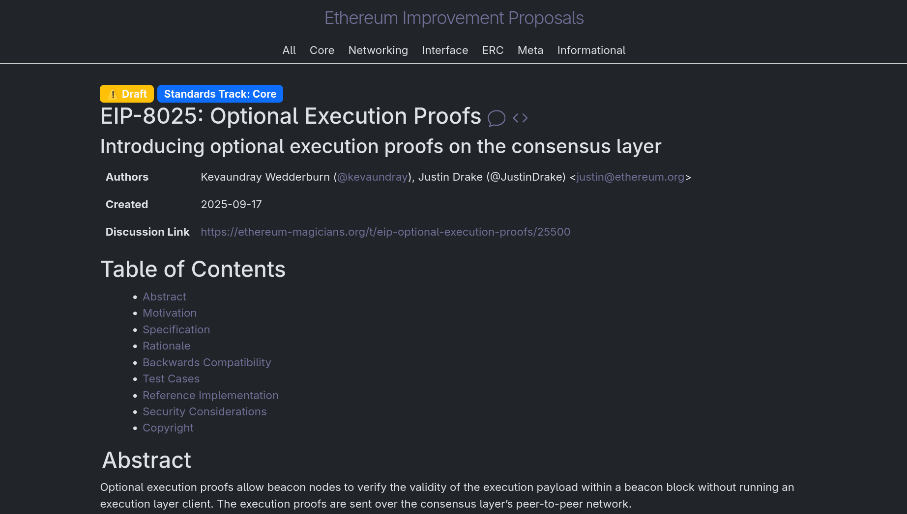

<!-- _class: lead -->

# Progress on zkEVM Scaling

Cody Gunton - EthBoulder 2026

---

# zkVMs & L1

zkVMs create a powerful asymmetry
  1) A network of low power nodes (verifiers) 
  2) can check the work of powerful nodes (provers) 
  3) using only a very small amount of data (hashes and proofs)

Our application is Ethereum attesting. 
  1) attesters will be low-power nodes who will verify proofs
  2) proofs will be produced by computationally powerful provers
  3) attesters will only need a small amount of data even as we increase throughput

---

# In Diagrams

* A program running in a virtual machine:
  

* 

A zkVM prover runs the program and produces a proof:

A zkVM verifier checks the proof without re-running the program:

---

# More specific diagrams

⚠️I am _not_ talking about replacing the EVM with a RISC-V machine ⚠️

---

# zkEVM = zkVM + Guest Program

There are many candidates zkVMs and there are many candidate "guest programs" (i.e., the transaction checking programs that need to be proved).

Justin Drake tracks these carefully and presents at Ethproofs [calls](https://youtube.com/playlist?list=PLJqWcTqh_zKGthi2bQDVOcNWXCSvH1sgB) and [events](https://youtube.com/playlist?list=PLJqWcTqh_zKF-gamT-xOEQD7BbrrIGlcH)

---

# How will we ship it?

 * Optional Proofs: client software ships with a flag that enables an extra step to deal with proofs and their verification, while still doing re-execution. 
   - Trial period for gathering data, experience, ironing out bugs.
   - Proofs are not required for the network to function unless a large % of people opt out of re-execution.
   - Cannot increase the gas limit.

 * Mandatory proofs
   - Proofs disappear ==> network down
   - Can incrase gas limit to where re-execution would fail to keep up with the chain on current attester hardware.

---

---

# Who is working on shipping this?

The various teams and stakeholders
eth-act, planning repo

---

# When will we ship this?

We

Insert gantt on next slide
Breakout call
Possible interop later in the year

---

# A deeper look at some specification initiatives

Foundation of security: a precise description of what we're building!

---

# What exactly are we putting in the protocol?

Consensus clients will be updated to contain zkVM verifiers (Rust or C++).

The [consensus clients specs](https://github.com/ethereum/consensus-specs), and their tests (Python) must be updated accordingly.

ZK is a fast moving field and teams mostly do not have specs of their proving systems.

Core papers exist, but prod systems differ in many ways, big and small. 

---

# What exactly are we putting in the protocol?

Some core questions we must answer:
 - Is the zk protocol behind {zkVM} secure?
 - Does {zkVM} implement is protocol correctly?
 - Does {zkVM} implement RISC-V correctly?
 - Does {guest program} implement the EVM correctly?

---

# Is the zk protocol behind {zkVM name} secure?

* _Soon:_ Whitepapers 
  Purpose: Researchers will provide formal guarantees of security.

* _Later:_ Arklib specs in Lean
  Purpose: Unambiguous formal description specification; formal verification engineers will make machine-assisted proofs of security claims.

# Does {zkVM name} implement its protocol correctly?

* _Soon:_ Auditing 
  Purpose: Auditors will check that the implementations match the specs.

* _Later:_ Formal proving
  Purpose: Formal verification engineers will show that a translation of the implementation to Lean matches the Lean spec using machine-assisted proving. 

---

# Does {zkVM name} implement RISC-V correctly?

  * _Done:_ Sail spec already written before Ethereum community interest. 
    Purpose: Describe a consistent set of rules for the operation of a computer. Reminder: this is the virtual computer that runs the EVM inside of a prover.
   _Later:_ Machine-assisted proofs that the zkEVMs correctly implement RISC-V.

---

# Does {guest program} implement the EVM correctly?

  * _Now:_ Formal specifications of the EVM
    Purpose: Describe the EVM in precise terms suitable for  
    _Now:_ Testing against this spec.
   _Later:_ Machine-assisted proofs that the zkEVMs correctly implement RISC-V.

---

# Accelerating with AI

Experiment: ZisK prover  & verifier (C++ & CUDA) --> Python then simplify
Reinforced by many tests.
⚠️Not a "spec" until the ZisK team matches it with their intentions ⚠️

TODO screenshot

---

# Accelerating with AI

Experiment: Simplified Python --> Lean
Reinforced by 'the same' tests.
⚠️Also not a "spec" until the ZisK team matches it with their intentions ⚠️

TODO screenshot

---

# Accelerating with AI

Experiment by Alex Hicks: 

---

# References
## Optional Proofs
https://eips.ethereum.org/EIPS/eip-8025
https://github.com/ethereum/consensus-specs/tree/master/specs/_features/eip8025

## Blog posts
Link to my blog post
Link to George's blog post

## Events
Breakout call link
Best Day
Possible interop event later this year

## Ongoing work:
Link to zisk specs

---

# Thanks!
<!-- _class: lead -->
<!-- _paginate: false -->
