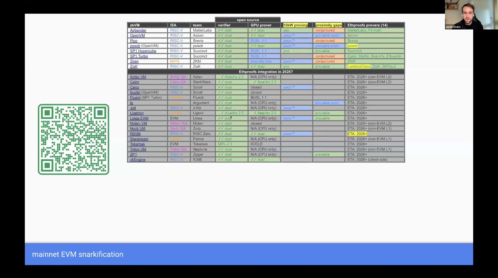
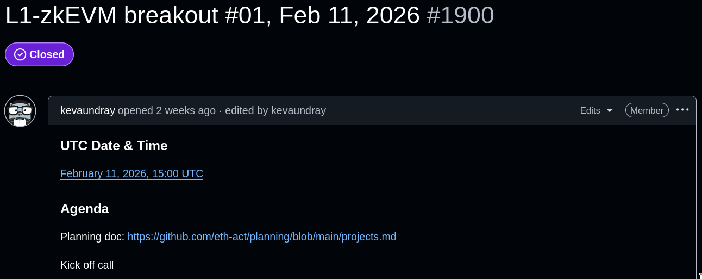
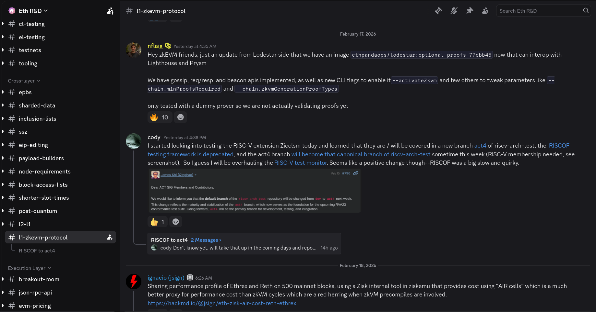
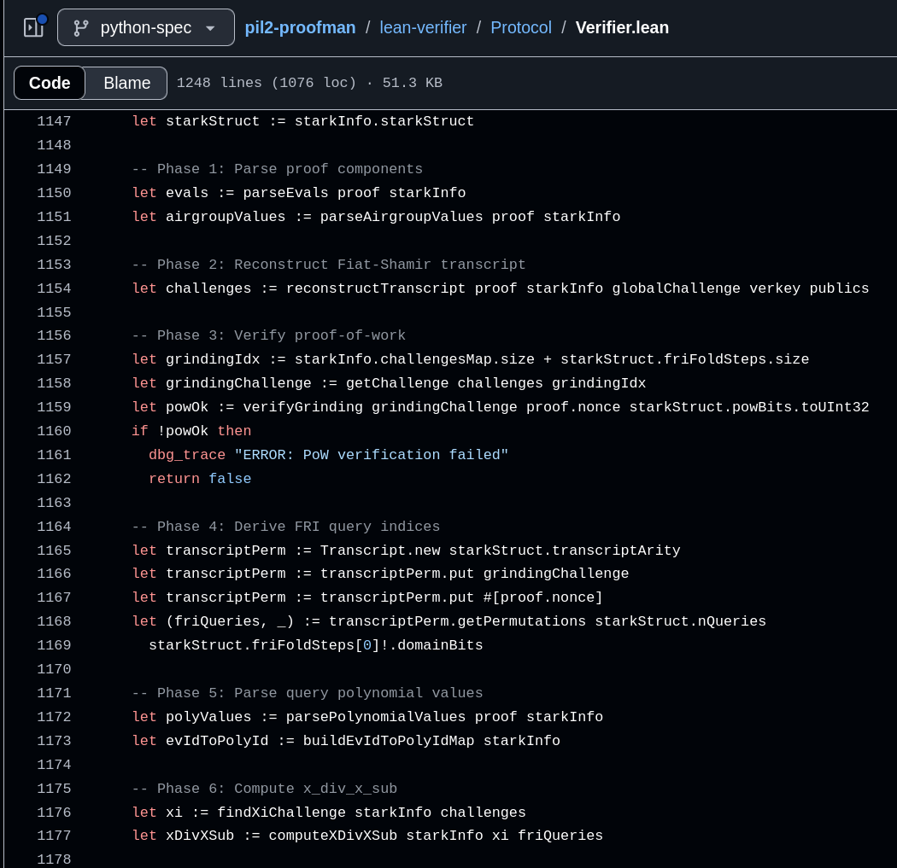

<!-- _class: lead -->

# The Road to zkEVM Scaling

https://codygunton.github.io/talks-and-writing/2026-02-19-ethdenver/

---

# zkVMs & L1

zkVMs create a powerful asymmetry
  1) A network of low-power nodes (verifiers)
  2) can check the work of powerful nodes (provers)
  3) using only a very small amount of data (hashes and proofs)

Our application is Ethereum attesting. 

Right now, attesters re-execute every transaction.
  1) attesters will be low-power nodes who will verify proofs
  2) proofs will be produced by computationally powerful provers
  3) attesters will only need a small amount of data even as we increase throughput

---

# Diagrams

  

  

  
⚠️ I am not talking about replacing the EVM with a RISC-V machine here ⚠️

---

# zkEVM = zkVM + Guest Program

There are many candidate zkVMs and many candidate "guest programs" (i.e., the transaction-checking programs that need to be proved).

Justin Drake tracks these carefully and presents at Ethproofs [calls](https://youtube.com/playlist?list=PLJqWcTqh_zKGthi2bQDVOcNWXCSvH1sgB) and [events](https://youtube.com/playlist?list=PLJqWcTqh_zKF-gamT-xOEQD7BbrrIGlcH).

---

# How will we ship this? In two phases:

 1) **Optional Proofs:** checks proofs and also keep re-executing 
   * Trial period for gathering data, experience, ironing out bugs.
   * Proofs are not required* for the network to function.
   * Cannot increase the gas limit because of this.

 2) **Mandatory proofs:** just check proofs
   * Proofs disappear ==> network down.
   * Can increase gas limit because of this.

---

---

# Who will ship this?

- zkVM developers
- Ethereum client developers
- EF zkEVM Team
- Justin Drake and EF Ethproofs Team
- EF Snarkification Team
- EF Cryptography Team
- EF EthPandaOps Team
- EF Robust Incentives Group
- EF Security Team
- Grantees

---

# What do the plans look like?

---

# Join us on Discord

---

# Security Roadmap to Optional Proofs

---

# Phase 1: Set inclusion criteria and launch blockers

---

# WIP: [Test Monitoring](https://eth-act.github.io/zkevm-test-monitor/index.html)
<!-- _style: "section { padding: 10px 20px; }" -->

<iframe src="https://eth-act.github.io/zkevm-test-monitor/index.html" style="width:100%;flex:1;border:1px solid #e2e8f0;border-radius:6px;"></iframe>

---

# WIP: Starter Specs in [Python, Lean](https://github.com/codygunton/pil2-proofman/tree/executable-specs) and [Markdown](https://codygunton.github.io/pil2-proofman/part-stark/full-protocol.html)
<!-- _style: "section { padding: 10px 20px; }" -->

  

    <iframe src="https://codygunton.github.io/pil2-proofman/part-stark/full-protocol.html" style="width:100%;flex:1;border:1px solid #e2e8f0;border-radius:6px;"></iframe>
  

  

    
  

---

# Phase 2: Choose zkEVMs

---

# Phase 3: Launch @ Hegotá target

---

# References

Some eth-act repositories
https://github.com/eth-act/planning
https://github.com/eth-act/zkvm-standards

Optional proofs
https://eips.ethereum.org/EIPS/eip-8025
https://github.com/ethereum/consensus-specs/tree/master/specs/_features/eip8025

Blog posts
https://zkevm.ethereum.foundation/blog/zkevm-security-overview
https://zkevm.ethereum.foundation/blog/cryptography-research-update

---

# Thanks for your attention!
<!-- _class: lead -->
<!-- _paginate: false -->
