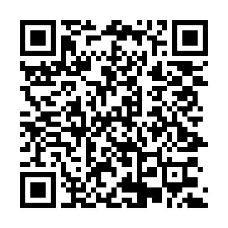
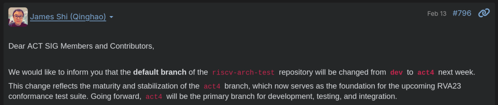

<!-- _class: lead -->

# Update on Project 7: Security

Cody Gunton - March 11, 2026

https://codygunton.github.io/talks-and-writing/2026-03-11-zkevm-breakout/

--- 

# RISC-V Compliance Testing

There are recent improvements to https://github.com/riscv/riscv-arch-test
 - RISCOF framework, more invasive to implement, is no more.
 - New tests!
 - Commitment to more legible release schedule.

TODO: update https://eth-act.github.io/zkevm-test-monitor/

---

# Soundcalc

What it is: a Python tool to calculate number of bits of security.

Five zkVMs integrated by requested deadline 
https://github.com/ethereum/soundcalc/blob/main/reports/summary.md

Thanks to the teams behind: Airbender, OpenVM, Pico, SP1, ZisK

---

# What does formal verification give us...?

<iframe src="https://eprint.iacr.org/2026/192" style="width:100%;flex:1;border:1px solid #e2e8f0;border-radius:6px;"></iframe>

---

# SNARK Specifications

https://codygunton.github.io/pil2-proofman/: Markdown guide to the Python implementation, the latter being the proposed starter.

<iframe src="https://codygunton.github.io/pil2-proofman/" style="width:100%;flex:1;border:1px solid #e2e8f0;border-radius:6px;"></iframe>

---

# Thanks for your attention!
<!-- _class: lead -->
<!-- _paginate: false -->

