<!-- _class: lead -->

# EPF Study Group #3: zkEVMs

Cody Gunton and Ignacio Hagopian - March 25, 2026

---

<!-- Placeholder for Introduction and ZKVMs sections (Cody's slides go here) -->

---

<!-- _class: lead -->

# Ethereum Guests

<!-- ~25 minutes for this section -->

---

# How does a node work today?

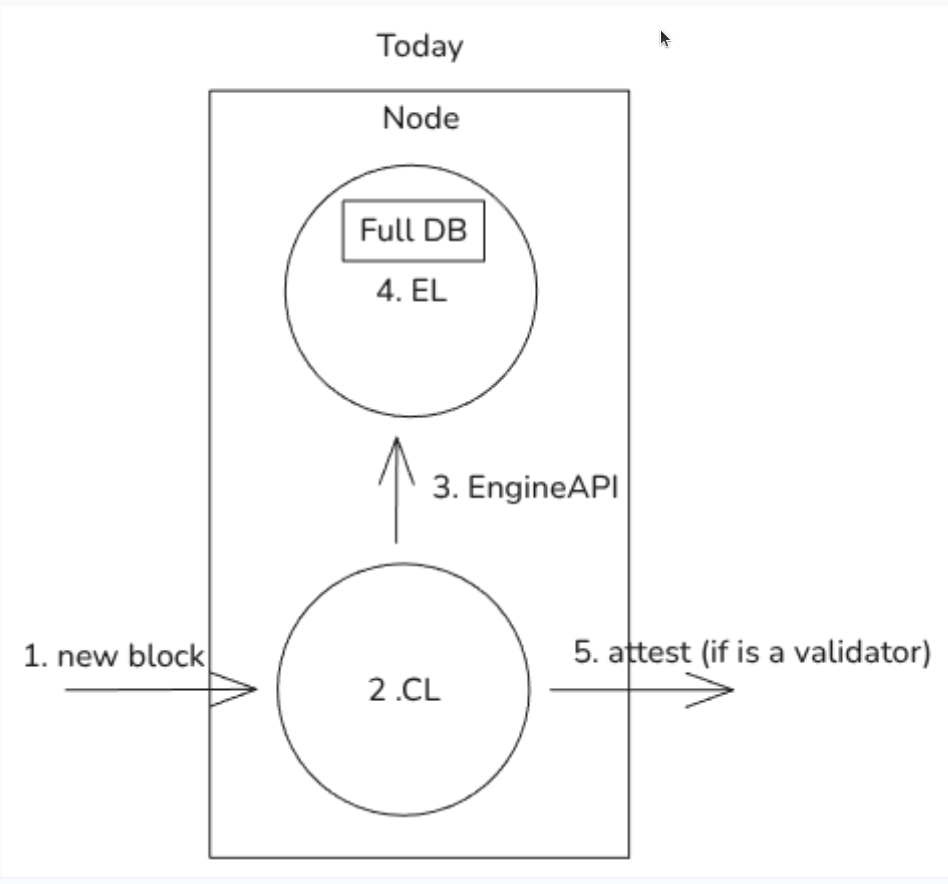

---

# Today vs Future

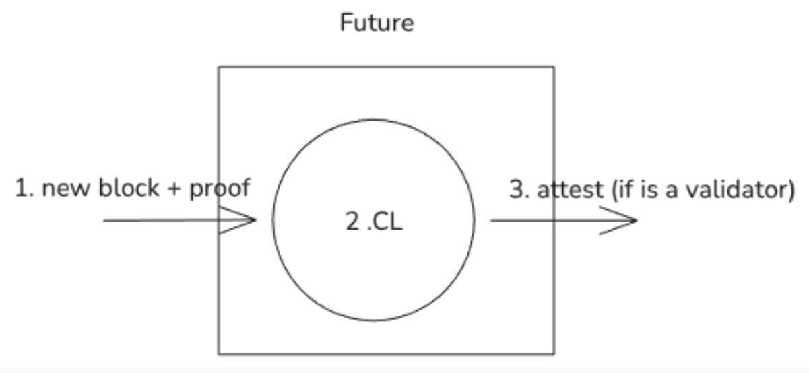

---

# How do zkVMs help the protocol as we increase the gas limit?

**CPU resources**
* Exploit prover-verifier asymmetry
* Proving is expensive, but verification is constant & cheap (<100ms)
* Offload computation from every node to a single prover
* At some gas limit, verifying a proof becomes **faster than re-executing**

**Storage resources**
* Remove the need for a full state database on the EL
* Execution witness provides just enough state

**Network resources**
* Proof size is small (~300KiB) and constant vs. block data
* Makes bandwidth usage more predictable and less bursty

---

# Protocol challenges that do not solve

**Full state requirement for particular roles**
* Outside protocol roles: RPC nodes, explorers
* In protocol roles: block builders 

**State growth/size**
* State growth still continues...
* Who stores the state?
* How do new nodes sync?
* Can we use zkVMs to help with this?

---

# Proof verification latency, size, and security

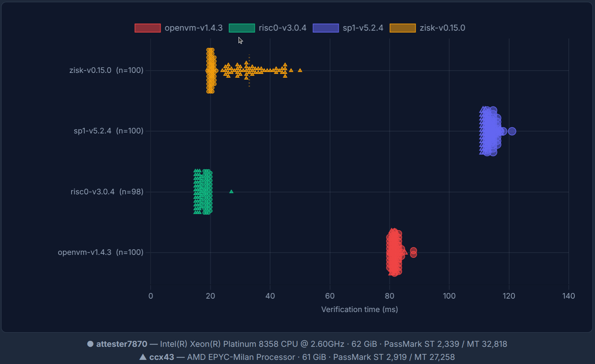

Proof verification dashboard

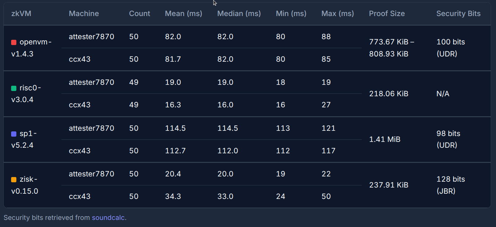

Soundcalc

---

# EngineAPI flows - Validation

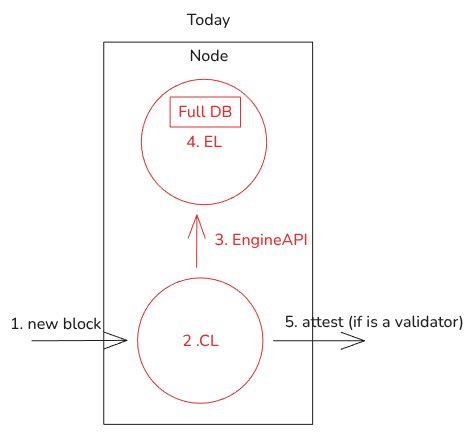

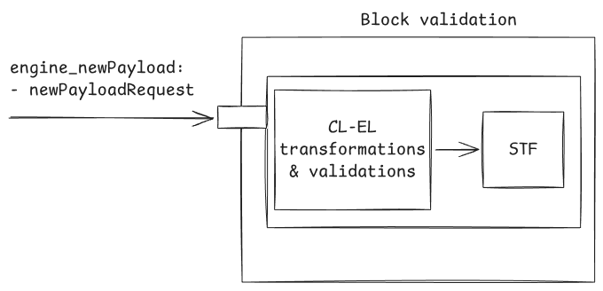

---

# The Guest Program

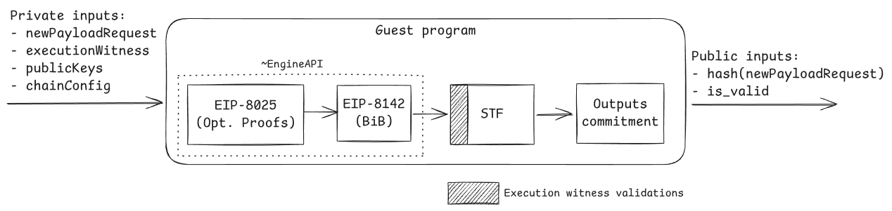

<!-- Key diagram: Private inputs -> [~EngineAPI: EIP-8025 (Opt. Proofs) -> EIP-8142 (BiB) -> STF -> Outputs commitment] -> Public inputs
     Hatched areas = Execution witness validations -->

---

# Private and public inputs

**Private inputs** (prover's data)
* `newPayloadRequest` — the full block payload
* `executionWitness` — state accessed by the block
* `publicKeys` — for tx signature verification
* `chainConfig` — fork rules, chain ID

**Public inputs** (verifier checks these)
* `hash(newPayloadRequest{Header})` — commitment to the block
* `is_valid` — was the block valid?

The proof convinces the CL that execution was correct **without re-executing**.

---

# Guest program - EngineAPI

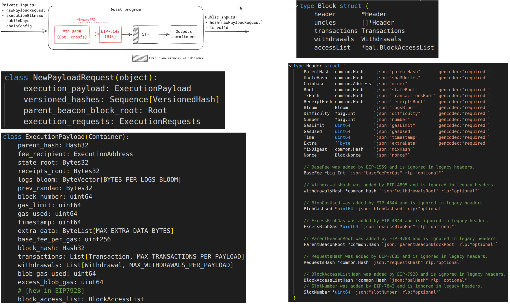

---

# Guest program - STF

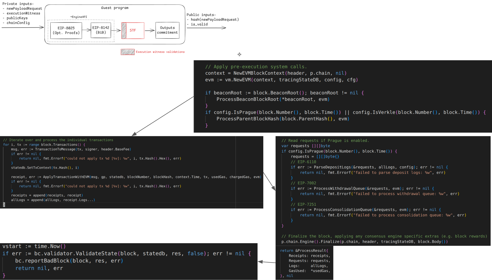

---

# Execution Witness

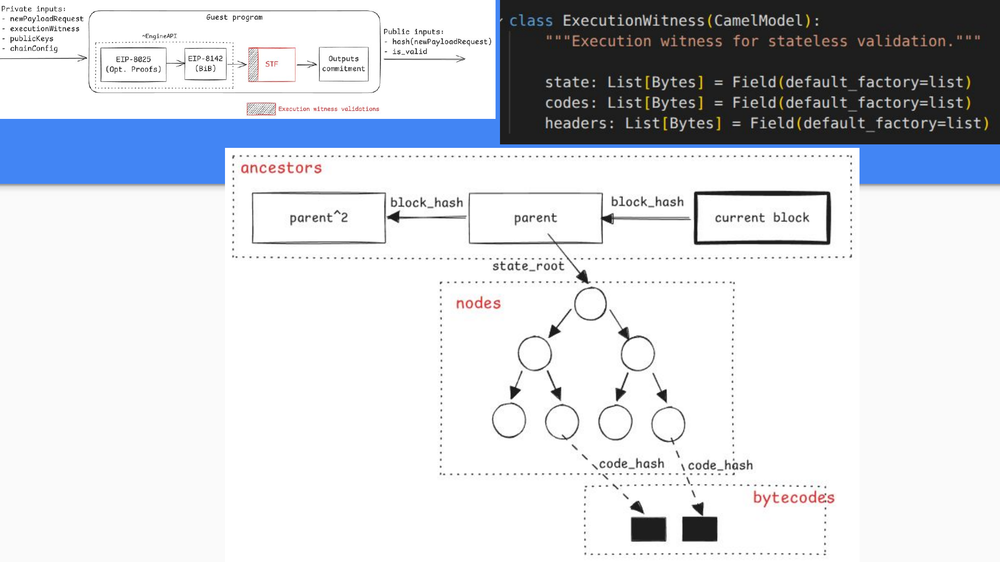

---

# Outputs commitment

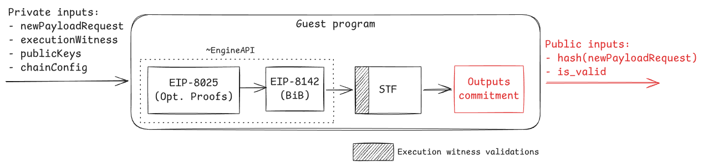
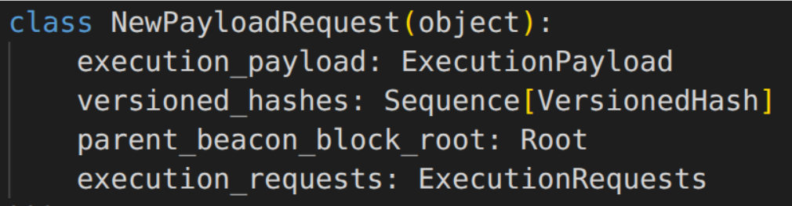

- `hash_tree_root(NewPayloadRequest) == hash_tree_root(NewPayloadRequestHeader)`

---

# How to build an Ethereum guest? (spec & tests)

- **Execution witness generation** 
   - Make generation fungible to maximize 
   - Example: https://github.com/Consensys/zevm-stateless

- **Guest program** 
   - Standarized input & output make them fungible
   - New particular logic should be thoroughly reviewed and tested (consensus critical & avoid invalid-block validation)

https://github.com/ethereum/execution-specs/tree/projects/zkevm
https://github.com/ethereum/execution-spec-tests/releases?q=zkevm&expanded=true

---

# How to build an Ethereum guest? (engineering)

**Two approaches:**

- **From scratch** — implement the guest program in a language that compiles to RISCV64IM
   - Example: https://github.com/Consensys/zevm-stateless

- **Refactor an existing EL** — adapt Ethrex, Geth, or Reth
   - Challenges: `no_std` support, refactorings, performance optimizations
   - Tension: re-execution mode vs. guest program mode

---

# zkEVM standards for zkVM-agnosticism

Goal: guest programs should work with **any** zkVM

- **Standard IO interface** for inputs and outputs
  - How the guest reads private inputs and writes public outputs
- **Accelerators** (zkVM precompiles) via standard C interface
  - Keccak256, secp256k1, BN254, etc.
  - Each zkVM implements these natively for performance
- **Target** (`riscv64im_zicclsm-unknown-none-elf`)
  - Define a minimal RISC-V instruction set for zkEVMs.

 https://github.com/eth-act/zkvm-standards/tree/main/standards

---

<!-- _class: lead -->

# Protocol Changes

<!-- ~15 minutes for this section -->

---

# Do we need protocol changes?

**Resources are limited**
* Capex (hardware costs)
* Opex (electricity, maintenance)
* Bandwidth

**We have constraints**
* Proving time
* Proof size (network overhead)
* Proof verification time
* Security bits (128 bits, provable security)

**Key question:** If the protocol isn't aware of proofs, who is responsible for generating and propagating them?

---

# What are "Prover Killers"?

Operations that are **cheap in gas** but **expensive to prove**.

An adversary can fill a block with them, making it unprovable in time.

**Example:**
* Gas pricing defines a required throughput (MGas/s)
* With ePBS + optional proofs: prover has ~12s for 60 Mgas → **5 MGas/s target**
* `ADD` costs 3 gas → prover must prove **1.66M ADD/s**
* What if we can only prove **1M ADD/s**?

---

# Repricing example

* `ADD` costs 3 gas today
* Required throughput: 5 MGas/s → need to prove 1.66M ADD/s
* Benchmarks show: can only prove **1M ADD/s**
* **ADD must cost 5 gas!**
  * At 5 gas: 1M ADD/s × 5 = 5 MGas/s ✓
  * Re-execution would still handle 3.33M × 5 = 16.65 MGas/s ✓

This is why benchmarking drives repricing decisions.

---

# FOCIL considerations

|  | Without FOCIL | With FOCIL |
|---|---|---|
| Block txs selection | Full liberty | Set of txs forced into it |
| Prover killers impact | Builder can avoid them | Can't avoid IL-txs impact |
| Forced gas | 0 gas | 1 IL × 40 txs × 17M = 680 Mgas |

**Workaround:** limit how much gas FOCIL can force into a block

- **Pro:** Impact of mispriced opcodes is bounded; repricing factor decreases
- **Con:** Censorship resistance guarantee is downgraded; non-sophisticated builders life is harder

---

# Benchmarks & repricing

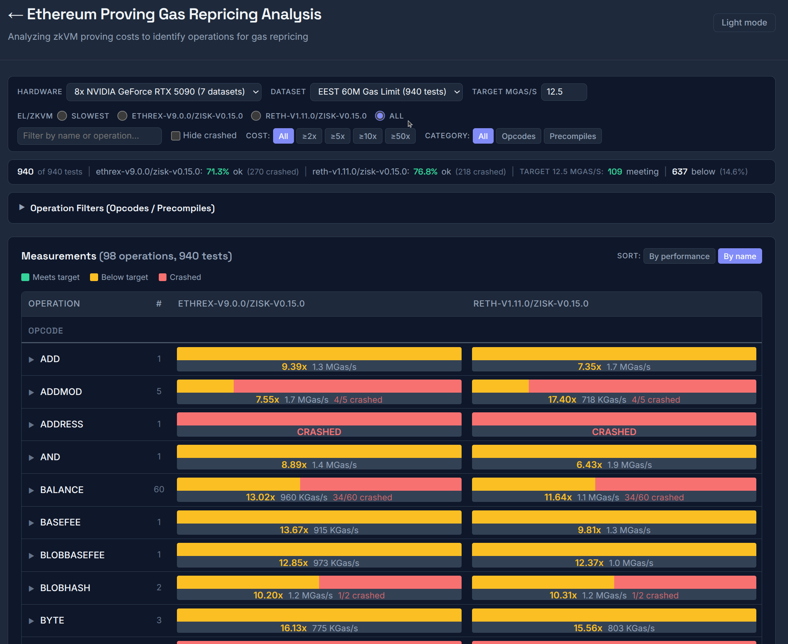

https://eth-act.github.io/zkevm-benchmark-runs/repricing/

---

# Not everything can be solved with repricing

- **Code-chunking** — split contracts bytecode into smaller and provable chunks to reduce bytecode verification worst-case 

- **Binary trees** — consider other tree-arity and other potential hash functions for merkelization to speedup proving

https://ethresear.ch/t/merkelizing-bytecode-options-tradeoffs/22255
https://ethereum-magicians.org/t/eip-7864-ethereum-state-using-a-unified-binary-tree/22611/6

---

# Gain more proving time: ePBS

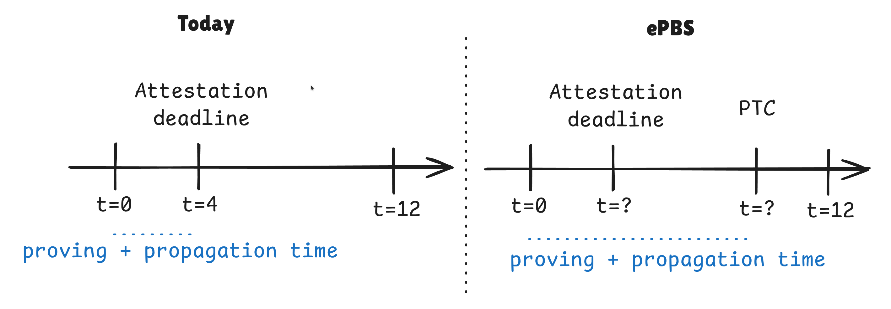

- State root calculation is delayed, buying time
- PTC deadline still under research (fixed/variable)
- EIP: https://eips.ethereum.org/EIPS/eip-7732

---

# Free network resources: Blocks in Blobs (EIP-8142)

- Verifying a block **doesn't require downloading the whole block**
- Block data is placed in blobs — only provers need the full data
- Validators just verify the proof
- **Releases bandwidth pressure** from the network in a safe way

---

# Prover incentives

* An economically-rational block builder **should want** to include proofs
  * Blocks with proofs propagate faster → better attestation inclusion
  * But how do we **ensure** they do?

<!-- TODO: this is still in research mode — fill in with latest thinking -->

---

# Thanks for your attention!
<!-- _class: lead -->
<!-- _paginate: false -->

