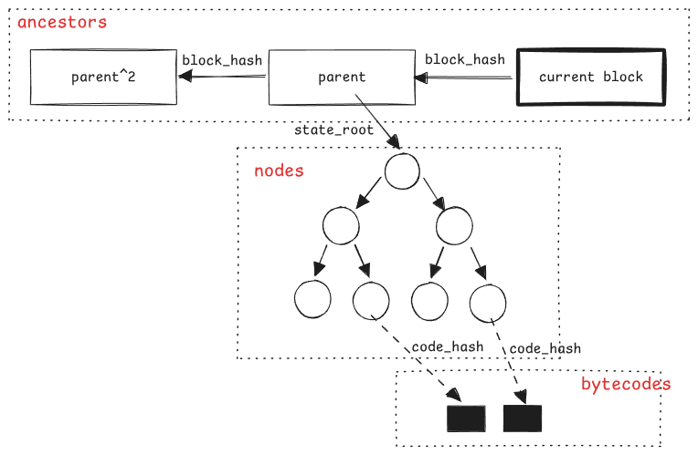
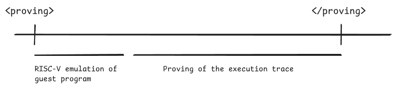
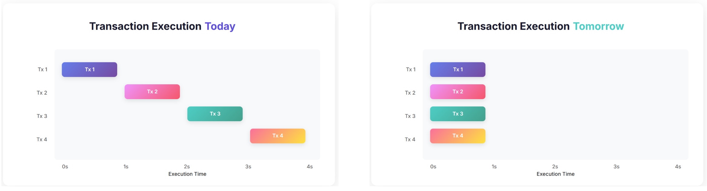
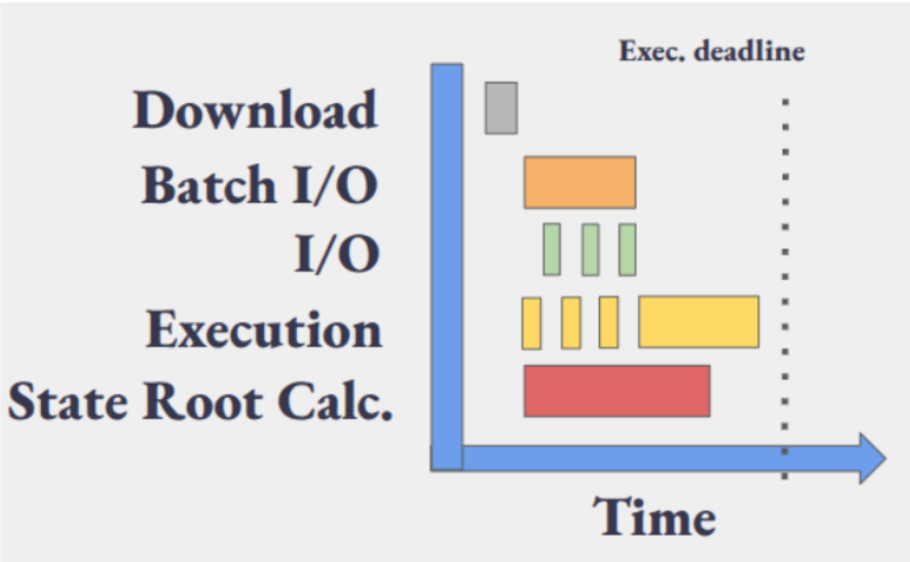
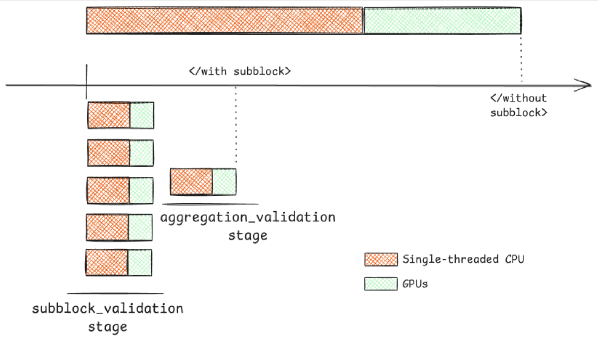

<!-- _class: lead -->

# EPF Study Group #3: zkEVMs

Cody Gunton and Ignacio Hagopian - March 25, 2026

https://codygunton.github.io/talks-and-writing/2026-03-25-epf-study-zkevms/

---

<!-- _class: lead -->

# Introduction

---

# Outline

 1. Why do we want zkEVMs? (The scaling problem)
 2. What is a SNARK? (Concepts and history)
 3. Ethereum guests (Ignacio)
 4. Protocol changes (Ignacio)

---

# Goal of introducing zkEVMs

Allow the EVM to execute more compute per block while keeping the work done by the consensus network small to preserve censorship resistance.

---

# Attester Requirements Today

An attester must re-execute every transaction and attest **within ~4s of slot start**.

 * **CPU:** 8 cores / 16 threads (PassMark: ~3500 ST, ~25000 MT)
 * **RAM:** 64 GB
 * **Storage:** 4 TB NVMe (500 MB/s seq, 50K read IOPS)
 * **Bandwidth:** 50 Mbps down / 25 Mbps up
 * As blocks get bigger, this time pressure is the bottleneck

See: [EIP-7870](https://eips.ethereum.org/EIPS/eip-7870)

---

# The Scaling Problem

If we allow more transactions in a block, eventually we exhaust the following attester resources:
 * bandwidth: the transactions don't arrive in time
 * compute: the transactions can't be processed quickly enough
 * state: the amount of storage used grows faster
   * solutions to the problem of state growth are needed sooner

State DB expected to degrade past ~650 GiB; at 60M gas that's ~349 MiB/day growth.

See: [EIP-8037: State Creation Gas Cost Increase](https://eips.ethereum.org/EIPS/eip-8037) (co-authored by CPerezz), [EIP-8032: Size-Based Storage Gas Pricing](https://eips.ethereum.org/EIPS/eip-8032)

---

# Block Size and Proof Size

* Average Ethereum block: **~100 KB**; max possible: **~7 MB** (calldata-heavy)
  * See: [etherscan.io/chart/blocksize](https://etherscan.io/chart/blocksize), [EIP-7623](https://eips.ethereum.org/EIPS/eip-7623)
* As gas limit increases, blocks get bigger — more data for attesters to download and process
* A SNARK proof: **≤300 KB** regardless of block size
  * Fixed-size proof replaces variable-size re-execution — this is the asymmetry

---

# ZKVM Prover-Verifier Asymmetry

zkVMs create a powerful asymmetry:
  1) A network of low-power nodes (verifiers)
  2) can check the work of powerful nodes (provers)
  3) using only a very small amount of data (hashes and proofs)

Our application is Ethereum attesting.

Right now, attesters re-execute every transaction.
  1) attesters will be low-power nodes who will verify proofs
  2) proofs will be produced by computationally powerful provers
  3) attesters will only need a small amount of data even as we increase throughput

---

# Optional vs Mandatory Proofs

<!-- NOTE: we might remove this slide — may be too much detail for the intro section -->

 1) **Optional Proofs:** checks proofs and also keeps re-executing
   * Trial period for gathering data, experience, ironing out bugs.
   * Proofs are not required for the network to function.
   * Cannot increase the gas limit because of this.

 2) **Mandatory proofs:** just check proofs
   * Proofs disappear ==> network down.
   * Can increase gas limit because of this.

---

# The Space Race

When I entered the space in 2021, I was told that zkEVMs were a pipe dream.

The possibility of proving Ethereum execution led to huge investment in ZK tech that rapidly advanced the field.

<!-- fragment: heading + first line show, then "Now" + iframe reveal together -->

* Now we're there™

<iframe src="https://ethproofs.org/" style="width:100%;flex:1;border:1px solid #e2e8f0;border-radius:6px;"></iframe>

---

<!-- _class: lead -->

# ZKVMs

---

# SNARK and other words

* **SNARK** (Succinct Non-interactive Argument of Knowledge): a logical argument that allows one party (a Prover) to convince another party (a Verifier) that they (the Prover) did the work of executing a particular computation
  * hazy terminology: SNARK, SNARK protocol, SNARK proof

* **ZKSNARK**: a SNARK where the Prover keeps some details of the computation private
  * requires extra engineering and computation; these are not widely in use yet

* **ZK**: a term abused to refer to the use of SNARKs in general

* **(ZK)STARK**: T = Transparent; used for systems without a certain trust assumption

* **ZKVM**: a particularly flexible approach to implementing SNARKs

---

# How It Started

<!-- See Justin Thaler's "Proofs, Arguments, and Zero-Knowledge" for a thorough treatment -->

 * **1985** -- Goldwasser, Micali, Rackoff define zero-knowledge proofs
 * **1992** -- Sumcheck protocol (Lund, Fortnow, Karloff, Nisan)
 * **2008-2010** -- Groth's pairing-based SNARK work; KZG polynomial commitments (Kate, Zaverucha, Goldberg)
 * **2013** -- Pinocchio: first nearly-practical zk-SNARK for general computation
 * **2014** -- [Zerocash paper](https://eprint.iacr.org/2014/349) (Ben-Sasson, Chiesa et al.)
 * **2016** -- Zcash Sprout launches with BCTV14 (a Pinocchio variant); **2018** -- Sapling upgrade switches to Groth16
 * **2018-now** -- FRI & STARKs (Ben-Sasson et al.), PLONK (Gabizon, Williamson, Ciobotaru)
 * **2020-now -- Now** Cairo/StarkWare (2020) → RISC Zero (2021, first RISC-V zkVM) → Polygon zkEVM & zkSync Era (2023, first zkEVM mainnets)

https://youtu.be/lv6iK9qezBY?si=iWXDOSfVfYDE2eYC
https://blog.lambdaclass.com/our-highly-subjective-view-on-the-history-of-zero-knowledge-proofs/
https://mfaulk.github.io/2024/10/28/evolution-of-snarks.html
https://ethresear.ch/t/accumulators-scalability-of-utxo-blockchains-and-data-availability/176
https://blog.ethereum.org/2016/12/05/zksnarks-in-a-nutshell

---

# Interactive Proof System

* There are two parties, Prover and Verifier
  * They agree on a computation. V wants to be convinced that P did the computation.
  * P writes down every step of the computation.
  * They exchange messages. The set of P messages = the proof.

* Typical part of the exchange:
  * V: "use this random number I chose to do some math and send me the result. I'll check the result satisfies this formula."
  * P: "even if I had all of the computers in the world, the only way I know of to make a result value that satisfies the formula is to be honest, so I guess I'll do that."

---

# Non-interactive Proof System

Goal: avoid P and V having to communicate over a network;

Solution: P uses an out-of-control function (hash function) to produce challenge values rather than asking V for random values.

<!-- TODO: add a different illustration here, not a table — will describe later -->

---

# Skeleton of a SNARK: The Program

P and V agree on the computation -- what does that mean?

Proof systems argue about computations given in special, low-level languages describing **arithmetic circuits**.
 * Traditional paradigm: everything is built up from logical operations like AND, NOT, OR, XOR, etc. 
 * Arithmetic circuits: everything is built up from arithmetic operations like +, *, -.

There exist special language for writing programs for SNARKS
 * e.g.: circom, Cairo, Noir, gnark
 * tooling is very fragmented (more on this :wink:)

---

# Skeleton of a SNARK: Proving

1) **witness generation**: execute the program, saving all intermediate values in a "witness", a collection of polynomials
2) **commitment computation**: create a binding fingerprint of the witness data using a polynomial commitment scheme
3) **reduction**: reduce checking the logic of each step in the computation is valid to check that logic "at a random point" is valid
4) **spot checking**: check the logic "at a random point" is valid
5) **PCS opening**: use the commitments to argue that the "random points" came from the witness

---

# Skeleton of a SNARK: Proving

1. **witness generation**: expensive serial bottleneck; returns polynomials (univariate or multilinear)
2. **commitment computation**: FRI-based or WHIR-based; KZG; Hyrax 
3. **reduction**: quotient argument; sumcheck
4. **spot checking**: evaluate the constraints at a random evaluation of the witnesses
5. **PCS opening**: checking Merkle proofs and FRI folding steps; computing an elliptic curve pairing.

---

# Putting This Into Practice: Generalities

Different applications have different requirements. Design space:

- How do we write programs for proving them?
- Does the application need privacy?
- Where will the program be proven?
  - Memory constraints?
  - Compute constraints?
- Where will the program be verified?
  - Bandwidth constraints on proof size?

---

# Putting This Into Practice: ZKVMs

Goal: 
 - allow developers to write programs using normal programming languages such as Rust or C++ or Go or Java.
 - unlock robust, maintainable systems
 - rely on widely used compiler infrastructure

Reality: 
 - huge success overall for Ethereum applications
 - only Rust and C++ work well and programmers still have to "target zk"
 - Go support is improving significantly in recent weeks

---

# zkEVM = zkVM + Guest Program

There are many candidate zkVMs and many candidate "guest programs" (i.e., the transaction-checking programs that need to be proved).

A **zkEVM** is what you get when you run an Ethereum execution client as a guest program inside a zkVM.

---

# RISC-V

Computers have different architectures. Common ones are x86_64 and ARM. Open standard gaining traction: RISC-V.

  

  

  
⚠️ I am not talking about replacing the EVM with a RISC-V machine here ⚠️

---

# Show the picture again

<!-- What is recursion in this context and why does it matter -->

---

<!-- Placeholder for Introduction and ZKVMs sections (Cody's slides go here) -->

---

<!-- _class: lead -->

# Ethereum Guests

<!-- ~25 minutes for this section -->

---

# How does a node work today?

---

# Today vs Future

---

# How do zkVMs help the as we increase the gas limit?

**CPU resources**
* Exploit prover-verifier asymmetry
* Proving is expensive, but verification is constant & cheap (<100ms)
* Offload computation from every node to a single prover
* At some gas limit, verifying a proof becomes **faster than re-executing**

**Storage resources**
* Remove the need for a full state database on the EL

**Network resources**
* Proof size is small (~300KiB) and constant vs. block data
* Makes bandwidth usage more predictable and less bursty

---

# Protocol challenges that do not solve

**Full state requirement for particular roles**
- Outside protocol roles: RPC nodes, explorers
- In protocol roles: block builders 

**State growth/size**
- State growth still continues...
- Who stores the state?
- How do new nodes sync?
- Can we use zkVMs to help with this?

---

# Proof verification latency, size, and security

Proof verification dashboard

Soundcalc

---

# EngineAPI flows - Validation

---

# The Guest Program

---

# Guest program - ~EngineAPI part

---

# Guest program - STF

---

# Execution Witness

---

# Outputs commitment

- `hash_tree_root(NewPayloadRequest) == hash_tree_root(NewPayloadRequestHeader)`

---

# How to build an Ethereum guest? (spec & tests)

- **Execution witness generation** 
   - Standarize its generation; any ELs can generate it if something goes wrong

- **Guest program** 
   - Standarized input & output make them fungible
   - New particular logic should be thoroughly reviewed and tested (consensus critical & avoid invalid-block validation)

https://github.com/ethereum/execution-specs/tree/projects/zkevm
https://github.com/ethereum/execution-spec-tests/releases?q=zkevm&expanded=true

---

# How to build an Ethereum guest? (engineering)

**Two approaches:**

- **From scratch** — implement the guest program in a language that compiles to RISCV64IM
   - Example: https://github.com/Consensys/zevm-stateless

- **Refactor an existing EL** — adapt Ethrex, Geth, or Reth
   - Challenges: `no_std` support, refactorings, performance optimizations
   - Tension: re-execution mode vs. guest program mode

---

# zkEVM standards for zkVM-agnosticism

Goal: guest programs should work with **any** zkVM

- **Standard IO interface** for inputs and outputs
  - How the guest reads private inputs and writes public outputs
- **Accelerators** (zkVM precompiles) via standard C interface
  - Keccak256, secp256k1, BN254, etc.
  - Each zkVM implements these natively for performance
- **Target** (`riscv64im_zicclsm-unknown-none-elf`)
  - Define a minimal RISC-V instruction set for zkEVMs.

 https://github.com/eth-act/zkvm-standards/tree/main/standards

---

<!-- _class: lead -->

# Protocol Changes

---

# Do we need protocol changes?

**Resources are limited**
* Capex (hardware costs)
* Opex (electricity, maintenance)
* Bandwidth

**We have constraints**
* Proving time
* Proof size (network overhead)
* Proof verification time
* Security bits (128 bits, provable security)

**Key question:** If the protocol isn't aware of proofs, who is responsible for generating and propagating them?

---

# What are "Prover Killers"?

Operations that are **cheap in gas** compared to **proving effort** (i.e. mispriced).

An adversary can fill a block with them, making it unprovable in time.

**Example:**
* Say we have 7s max. as proving time
* For 60M gas limit, ADD 3 gas => max ~20M ADD in a block => need 2.85M ADD/s
* What if we benchmark and find we can only do 1M ADD/s?
* ADD price scaled by 2.85x ==> ADD price ~9 gas.

https://zkevm.ethereum.foundation/blog/repricings-for-block-proving-part-1
https://zkevm.ethereum.foundation/blog/repricings-for-block-proving-part-2

---

# FOCIL considerations

|  | Without FOCIL | With FOCIL |
|---|---|---|
| Block txs selection | Full liberty | Set of txs forced into it |
| Prover killers impact | Builder can avoid them | Can't avoid IL-txs impact |
| Forced gas | 0 gas | 1 IL × 40 txs × 17M = 680 Mgas |

---

# Benchmarks & repricing

https://eth-act.github.io/zkevm-benchmark-runs/repricing/

---

# Not everything can be solved with repricing

- **Code-chunking** — split contracts bytecode into smaller and provable chunks to reduce bytecode verification worst-case 

- **Binary trees** — consider other tree-arity and other potential hash functions for merkelization to speedup proving

https://ethresear.ch/t/merkelizing-bytecode-options-tradeoffs/22255
https://ethereum-magicians.org/t/eip-7864-ethereum-state-using-a-unified-binary-tree/22611/6

---

# Gain more proving time: ePBS

- State root calculation is delayed, buying time
- PTC deadline still under research (fixed/variable)
- EIP: https://eips.ethereum.org/EIPS/eip-7732

---

# Free network resources: Blocks in Blobs (EIP-8142)

- Verifying a block **doesn't require downloading the whole block**
- Block data is placed in blobs — only provers need the full data
- Validators just verify the proof
- **Releases bandwidth pressure** from the network in a safe way

https://eips.ethereum.org/EIPS/eip-8142

---

# Which "mechanical" changes we can do to speed up?

  - RISC-V emulation: single threaded
  - Proving of execution trace: highly parallelizable with GPUs

---

# BALs for re-execution acceleration

https://eips.ethereum.org/EIPS/eip-7928

---

# BALs for proving acceleration

---

# Prover incentives

- An economically-rational block builder **should want** to include proofs
  - But how do we **ensure** they do?
  - Capex/Opex ties into protocol economics
  - Are current block rewards (+ MEV) enough?
  - What is the relationship between builder and prover?

---

# Get Involved

* **Ethproofs calls & events:** [youtube.com/playlist](https://youtube.com/playlist?list=PLJqWcTqh_zKGthi2bQDVOcNWXCSvH1sgB) — including **Beast Mode** this week
* **zkEVM team calls:** coordination on guest programs, zkVM integration, and protocol changes

---

# Thanks for your attention!
<!-- _class: lead -->
<!-- _paginate: false -->

