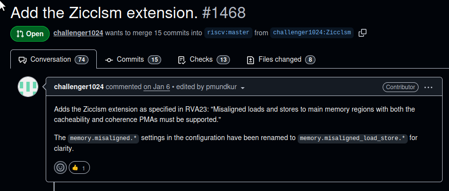

<!-- _class: lead -->

# Update on Project 7: Security

Cody Gunton - April 8, 2026

https://codygunton.github.io/talks-and-writing/2026-04-08-zkevm-breakout/

--- 

# RISC-V Compliance

* **Testing:** Across three different zkVMs, I identified and reported many bugs and RISC-V compliance issues. Will report more after further consultation.

* **Fuzzing:** Grantees reporting and finding bugs; will disclose publicly in time.

* **Specs:** "Golden Model" updates: https://github.com/riscv/sail-riscv/pull/1468

---

# What does formal verification give us...?

<iframe src="https://eprint.iacr.org/2026/670" style="width:100%;flex:1;border:1px solid #e2e8f0;border-radius:6px;"></iframe>

---

# SNARK Specifications

https://codygunton.github.io/openvm/: Markdown guide to the Python implementation, the latter being the proposed starter.

<iframe src="https://codygunton.github.io/openvm/" style="width:100%;flex:1;border:1px solid #e2e8f0;border-radius:6px;"></iframe>

---

# Thanks for your attention!
<!-- _class: lead -->
<!-- _paginate: false -->

