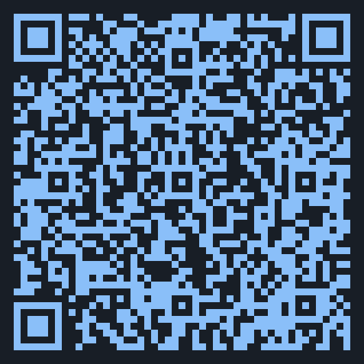

<!-- _class: lead -->

# Update on Project 7: Security

Cody Gunton - May 13, 2026

https://codygunton.github.io/talks-and-writing/2026-05-13-zkevm-breakout/

---

# Fuzzing findings

An EF grantee has found six bugs across three different zkVMs by fuzzing. 

Some patches have been upstreamed.

Expect a report this Summer.

---

# ZisK RISC-V Formal Verification RFC

Taking https://github.com/openvm-org/openvm-fv as a blueprint, I have an initial draft of https://github.com/eth-act/zisk-fv giving formal verification of ZisK's RISC-V circuit.
  * Expect ready for external review in <2 weeks

---

# Architecture Whitepapers

The EF Cryptography Team's target date for V1 architecture white papers passed and many submissions were received.

Thanks for your submissions!

---

# Formal verification highlights

* **Computable FRI Specification and Soundness**
*What:* Integrated CompPoly into FRI spec to make it computable; proved soundness for FRI-Binius protocols, closed SingleRound sorrys, and formalized correlated agreement for affine spaces in proximity gap proofs.
*Refs:* ArkLib #496, #476, #455, #454, #417, #460, #475, #482, #456, #452, #461

* **Sumcheck Perfect Completeness Proofs**
*What:* Proved perfect completeness for sumcheck single-round reductions and component-level completeness for the oracle reduction chain.
*Refs:* ArkLib #449, #446, #445, #444

---

# ZisK RV64IM_Zicclsm near-compliance

Recent work by Nethermind gets ZisK Close to being *the first ZKEVM to full compliance with the [Eth-ACT ISA standard](https://github.com/eth-act/zkvm-standards/blob/main/standards/riscv-target/target.md)*
 * TLDR: adds support for unaligned accesses
 * Remaining cases are nits about NOPing certain `fence` instructions
 * Branch: https://github.com/NethermindEth/zisk/tree/feature/nethermind_test

---

# Thanks for your attention!
<!-- _class: lead -->
<!-- _paginate: false -->

